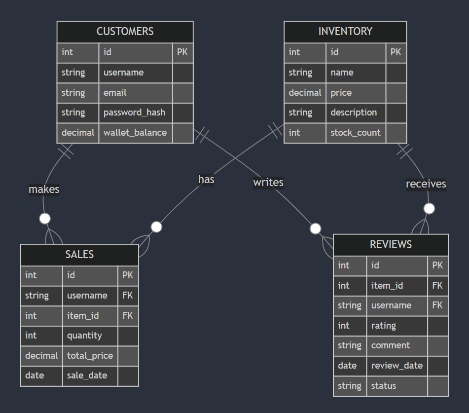

# E-Commerce-Shop
# E-Commerce Shop: Microservices-Based Application - Backend

## Table of Contents
1. [Project Overview](#project-overview)
2. [Features](#features)
3. [Services](#services)
4. [Getting Started](#getting-started)
   - [Prerequisites](#prerequisites)
   - [Setup and Installation](#setup-and-installation)
   - [Running the Application](#running-the-application)
5. [API Documentation](#api-documentation)
6. [Testing](#testing)
7. [Profiling and Performance](#profiling-and-performance)
8. [Database Schema](#database-schema)
9. [Contributing](#contributing)
10. [License](#license)

---

## Project Overview

The **E-Commerce Shop** is a microservices-based application designed to simulate an online shopping platform. It consists of four main services:
- **Customers Service**: Manages user data and authentication.
- **Inventory Service**: Handles product information and stock management.
- **Sales Service**: Processes customer purchases and maintains sales history.
- **Reviews Service**: Enables customers to leave reviews and ratings for products.

The project showcases advanced features like containerization using Docker, detailed API documentation, comprehensive testing, and performance profiling.

---

## Features

- **User Management**: Add, update, and delete customer profiles.
- **Product Management**: Add, update, delete, and fetch inventory items.
- **Sales Processing**: Handle sales transactions, including stock and balance updates.
- **Review Management**: Submit, update, delete, and moderate product reviews.
- **Scalable Architecture**: Each service runs independently for easy scaling.
- **Containerized Deployment**: Services are packaged using Docker for consistent deployment.

---

## Services

### Customers Service
- **Responsibilities**: Manage customer data and wallet balance.
- **Endpoints**: Register, update, delete, and fetch customer profiles.

### Inventory Service
- **Responsibilities**: Manage inventory items.
- **Endpoints**: Add, update, delete, and fetch inventory data.

### Sales Service
- **Responsibilities**: Process sales transactions and track purchase history.
- **Endpoints**: Display goods, process sales, and fetch purchase history.

### Reviews Service
- **Responsibilities**: Handle product reviews.
- **Endpoints**: Submit, update, delete, and moderate reviews.

---

## Getting Started

### Prerequisites

Ensure you have the following installed on your system:
- Python 3.9 or higher
- Docker and Docker Compose
- `pip` for Python package management

### Setup and Installation

1. Clone the repository:
   ```bash
   git clone https://github.com/bna14/E-Commerce-Shop.git
   cd E-Commerce-Shop
   ```

2. Set up a Python virtual environment and install dependencies:
   ```bash
   python -m venv .venv
   source .venv/bin/activate  # On Windows: .venv\Scripts\activate
   pip install -r requirements.txt
   ```

3. Build Docker images for the services:
   ```bash
   docker-compose build
   ```

---

## Running the Application

To start all services using Docker Compose:
```bash
docker-compose up
```

The services will be accessible on the following ports:
- Customers Service: `http://localhost:5000`
- Inventory Service: `http://localhost:5001`
- Sales Service: `http://localhost:5002`
- Reviews Service: `http://localhost:5003`

---

## API Documentation

Comprehensive API documentation is generated using Sphinx. You can access it by navigating to the `/build/html/index.html` file after building the docs.

To build the documentation:
```bash
cd docs
make html
```

---

## Testing

Unit and integration tests are written using Pytest. Run the tests using:
```bash
pytest tests/
```

Test coverage reports can be generated using:
```bash
coverage run -m pytest
coverage report -m
```

---

## Profiling and Performance

Performance profiling was conducted using `cProfile` and memory profiling using `memory_profiler`. Insights include:
- Stable memory usage across all services.
- Efficient request-handling performance under test scenarios.

---

## Database Schema

The database schema includes four tables:
- **Customers**: Stores user details.
- **Inventory**: Maintains product data.
- **Sales**: Records transaction history.
- **Reviews**: Stores customer feedback.



---
